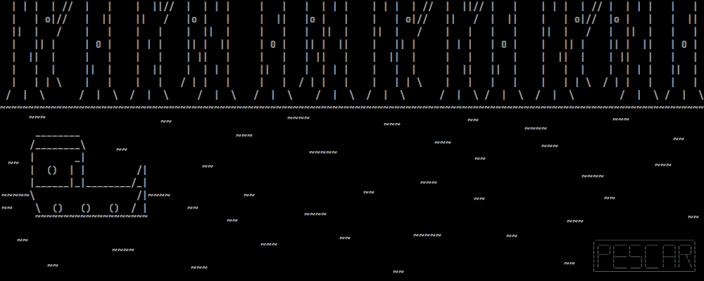

# Amazon ASCII Fishing

[](https://www.python.org/)
[](https://www.pygame.org/)



## About The Project

**Amazon ASCII Fishing** is a fishing game prototype created as a personal project born from a passion for games and fishing. It features a distinct ASCII art style, inspired by games like *Stone Story RPG*.

This application was built with:
* **Python**
* **Pygame** for rendering, game logic, and event handling.

This project was a learning exercise and is no longer in active development.

## Project Structure

The repository is organized as follows:

```
.
├── assets/                   # Contains game assets like images and sounds.
├── JogoFinal.py                   # The main script to run the game.
└── requirements.txt          # A list of all necessary Python packages.
```

## Getting Started

To get a local copy up and running, follow these simple steps.

### Pre-requisites

Make sure you have the following installed on your system:
* Python 3.9 or higher
* pip

### Installation

1.  Clone the repository to your local machine.
    ```bash
    git clone https://github.com/BBennemann/Amazon-ASCII-Fishing.git
    ```

2.  Navigate to the project directory.
    ```bash
    cd Amazon-ASCII-Fishing
    ```
3.  It is highly recommended to create and activate a virtual environment.
    ```bash
    # For Windows
    python -m venv venv
    venv\Scripts\activate

    # For macOS/Linux
    python3 -m venv venv
    source venv/bin/activate
    ```
4.  Install the required packages.
    ```bash
    pip install -r requirements.txt
    ```

## Usage Instructions

To play the game, simply run the `JogoFinal.py` script from your terminal:

```bash
python JogoFinal.py
```
## Contributors

* **Bernardo Thomas Bennemann** - *Project Owner* - [BBennemann](https://github.com/BBennemann)
